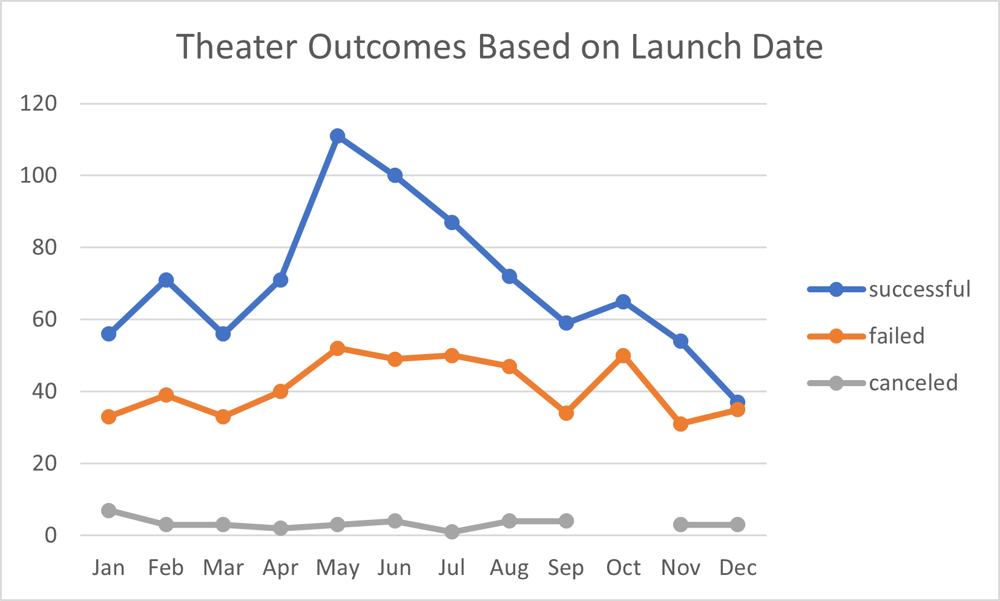
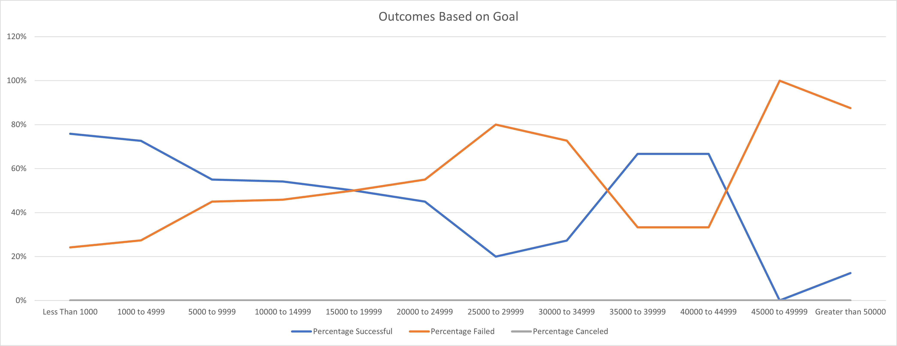

# Kickstarting with Excel

## Overview of Project

### Purpose

Louise recently completed a crowdfunding campaign for a play that almost met her fundraising goal. She would like to know if launch dates and funding goals are factors that contribute to a successful campaign. I will be using a Kickstarter dataset to analyze trends and visualize any patterns.

## Analysis and Challenges

### Analysis of Outcomes Based on Launch Date

In order to compare similar projects, I focused on the theater parent category and filtered out any live campaigns since those are still ongoing and the result is unknown. After converting the Unix timestamps to a traditional date format, the launch dates and outcomes can be summarized and grouped together by month.

The following chart displays theater outcomes based on launch date for all years of available data.

### Analysis of Outcomes Based on Goals

When analyzing the outcomes based on goals, I used the same filtered dataset as above but further refined it to only include plays. One reason for this is that theater spaces are usually more expensive, and I did not want the data to be skewed when we're specifically interested in plays. In order to summarize and group the data, I created dollar-amount ranges for the funding goal. For each goal range, I calculated the percentage of successful, failed, and canceled projects.

The following chart shows the outcomes based on goal for plays.

### Challenges and Difficulties Encountered

While there were no challenges or difficulties encountered during this project, there are possible issues that I could have experienced. There may not have been enough data for the category that I was interested in, however, theater projects are the most common Kickstarter campaign type. Also, the data could have been incomplete and contain columns with missing information which could make some of the data rows or columns unusable.

## Results

- There are a couple conclusions that can be drawn about the Outcomes based on Launch Date. May has the greatest number of successful theater campaigns, followed by June and July. May appears to be the best month to launch a campaign, with the largest difference between the number of successful and failed projects. On the other hand, December appears to be the worst month to launch a campaign, with about the same number of successful projects as failed projects.

- For the Outcomes based on Goals, it can be concluded that in general a play campaign is less likely to be successful as its funding goal increases. Plays with large fundraising goals have a greater chance of failing, although there are a few that managed to be successful, but they appear to be outliers. 

- There are some limitations of this dataset in that it only includes Kickstarter campaigns. There are many other crowdfunding websites that have not been considered. It also doesn't include other types of fundraising such as in-person events.

- Some other possible graphs that could be created are outcomes based on average donation and outcomes based on length of campaign.
